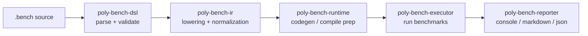

# poly-bench

[](https://github.com/evm-tooling/poly-bech/actions/workflows/ci.yml)
[](https://github.com/evm-tooling/poly-bech/actions/workflows/ci-docs.yml)
[](https://github.com/evm-tooling/poly-bech/actions/workflows/release.yml)
[](https://github.com/evm-tooling/poly-bech/actions/workflows/release-build.yml)

A high-performance multi-language benchmarking framework with a custom DSL and full LSP support.

## Overview

poly-bench lets you define benchmarks once and run them across multiple languages (Go, TypeScript, Rust) with unified output and comparison. It's designed for:

- **Cross-language library comparisons** — Compare your Go library against its TypeScript equivalent
- **Performance regression testing** — Track performance across languages over time
- **Fair benchmarking** — Same data, same iterations, unified measurement

## Architecture

poly-bench is a modular Rust workspace. A `.bench` file is parsed, validated, lowered to IR, compiled/generated for each language target, executed in isolated runtime environments, and then reported in multiple formats.

### End-to-End Flow



### Workspace Components

The repository is split by responsibility so each stage can evolve independently:

| Crate | Responsibility |
|---|---|
| `poly-bench-dsl` | DSL lexer/parser, AST, validation, and formatting for `.bench` files |
| `poly-bench-ir` | Intermediate representation used by downstream compile/run stages |
| `poly-bench-runtime` | Runtime-specific code generation and execution adapters |
| `poly-bench-executor` | Benchmark orchestration, iteration flow, measurement collection |
| `poly-bench-reporter` | Rendering benchmark results (console, markdown, json) |
| `poly-bench-project` | Project initialization, manifest/dependency workflows |
| `poly-bench-stdlib` | Built-in DSL modules (`std::anvil`, `std::charting`, `std::constants`) |
| `poly-bench-syntax` + `tree-sitter-polybench` | Error-tolerant syntax layer and grammar tooling |
| `poly-bench-lsp-v2` | Current LSP implementation powering editor diagnostics, formatting, and completions |

### Execution Model

- **Compile-like pipeline**: The DSL is normalized before execution so runtimes consume a consistent, validated IR.
- **Isolated language runtimes**: Go/TypeScript/Rust execution is separated to reduce cross-language environment leakage.
- **Comparable runs**: Shared fixtures and suite-level configuration keep measurements aligned across languages.
- **Output decoupling**: Report formatting is separated from execution, so CI automation can consume machine-readable output while humans get rich console summaries.

### CLI and Runtime Architecture

The `poly-bench` CLI is an orchestrator over workspace crates rather than a monolith. High-level command groups map cleanly to architectural layers:

- **Authoring/validation**: `check`, `fmt`, `compile`, `codegen`
- **Execution**: `run`
- **Project lifecycle**: `init`, `new`, `add`, `remove`, `install`, `build`
- **Tooling/runtime state**: `cache stats|clear|clean`, `lsp`

This keeps the CLI surface area broad while retaining narrow internal module boundaries.

### LSP Architecture (v2)

The LSP uses the syntax + DSL layers for robust editor behavior, including partial/error-tolerant parsing, semantic diagnostics, and formatting of `.bench` files. It is exposed through `poly-bench lsp` and consumed by the VS Code/Cursor extension in `extensions/vscode`.

For deeper implementation detail, see the docs architecture page: `docs/src/content/docs/core/architecture.mdx`.

## Quick Start

```bash
# Install
curl -sSL https://polybench.evm-tooling.tools | bash

# Initialize a project
poly-bench init my-benchmarks

# Run benchmarks
poly-bench run
```

## Language Features

### Suite Structure

```rust
use std::charting

suite hash {
    description: "Hash function benchmarks"
    iterations: 5000
    warmup: 1000
    baseline: "go"
    
    setup go {
        import "crypto/sha256"
        
        helpers {
            func hash(data []byte) []byte {
                h := sha256.Sum256(data)
                return h[:]
            }
        }
    }
    
    setup ts {
        import { keccak256 } from 'viem'
    }
    
    fixture data {
        hex: "68656c6c6f20776f726c64"  # "hello world"
    }
    
    bench sha256 {
        go:  hash(data)
        ts:  keccak256(data_hex)
    }
}
```

### DSL Keywords

| Keyword | Description |
|---------|-------------|
| `suite` | Top-level container for benchmarks |
| `setup <lang>` | Language-specific initialization (imports, helpers, init code) |
| `fixture` | Shared test data with portable hex encoding |
| `bench` | Individual benchmark definition |
| `globalSetup` | File-level initialization (e.g., spawning Anvil) |
| `use std::*` | Import standard library modules |

### Suite Configuration

```rust
suite example {
    description: "Suite description"
    iterations: 5000           # Default iteration count
    // [!code focus:4]
    warmup: 1000               # Warmup iterations before timing
    baseline: "go"             # Baseline language for comparisons
    mode: "auto"               # "auto" (calibrate to targetTime) or "fixed"
    targetTime: 3000ms         # Target time for auto mode
    count: 3                   # Runs per benchmark for statistics
    memory: true               # Enable memory allocation profiling
    outlierDetection: true     # IQR-based outlier removal
    cvThreshold: 5.0           # Coefficient of variation target (%)
    timeout: 30000             # Suite timeout (ms)
    sink: true                 # Prevent dead code elimination
}
```

### Setup Blocks

Setup blocks contain language-specific initialization with four sections:

```rust
setup go {
    import "crypto/sha256"
    import "encoding/hex"
    
    declare {
        var globalCounter int
        type Config struct { Size int }
    }
    
    init {
        globalCounter = 0
    }
    
    helpers {
        func hash(data []byte) []byte {
            h := sha256.Sum256(data)
            return h[:]
        }
    }
}
```

### Fixtures

Portable test data shared across languages:

```rust
# Hex-encoded data
fixture short_data {
    hex: "deadbeef"
}

# Load from file
fixture long_data {
    hex: @file("fixtures/1kb.hex")
}

# Language-specific implementations
fixture complex {
    go:   buildComplexStruct()
    ts:   buildComplexObject()
    rust: build_complex_struct()
}
```

### Benchmarks

```rust
bench keccak256 {
    description: "Keccak-256 hash"
    iterations: 10000          # Override suite default
    warmup: 500
    timeout: 5000
    tags: ["crypto", "hash"]
    
    before {
        go:   prepareData()
        ts:   prepareData()
    }
    
    go:   keccak256(data)
    ts:   keccak256(data_hex)
    rust: keccak256(&data)
    
    after {
        go: logResult()
        ts: logResult()
    }
    
    validate {
        go:   len(result) == 32
        ts:   result.length === 66
    }
}
```

### Lifecycle Hooks

- `before` — Runs once before benchmark iterations
- `after` — Runs once after iterations (per-language teardown/inspection)
- `each` — Runs before each iteration (outside timing)

### Standard Library

```rust
use std::anvil      # Ethereum node spawning
use std::charting   # Chart generation
use std::constants  # Mathematical constants

globalSetup {
    anvil.spawnAnvil(fork: "https://eth-mainnet.g.alchemy.com/v2/...")
}

bench example {
    go: doSomething(os.Getenv("ANVIL_RPC_URL"))
    
    after {
        // [!code focus]
        charting.drawTable(title: "Results", output: "results-table.svg", sortBy: "speedup")
        charting.drawSpeedupChart(title: "Speedup")
    }
}
```

## LSP Support

poly-bench includes a full-featured language server for editor integration.

### Features

| Feature | Description |
|---------|-------------|
| **Diagnostics** | Parse errors, validation warnings, embedded language type checking |
| **Formatting** | Document formatting with proper indentation |
| **Completions** | Context-aware completions for keywords, stdlib, and user symbols |
| **Hover** | Documentation for DSL keywords and stdlib; delegates to gopls/tsserver/rust-analyzer for embedded code |
| **Semantic Highlighting** | Full syntax highlighting via semantic tokens |
| **Embedded Language Support** | Go, TypeScript, and Rust code blocks are checked by their respective language servers |

### Editor Extensions

- **VS Code / Cursor**: Install from `extensions/vscode` or the marketplace
- More editors coming soon

### Starting the LSP

```bash
poly-bench lsp  # Starts language server on stdio
```

## CLI Reference

### Core Commands

```bash
poly-bench check <file>           # Parse and validate
poly-bench compile [<file>]       # Compile-check without running
poly-bench cache stats            # Show compile cache/workspace stats
poly-bench cache clear            # Clear compile cache
poly-bench cache clean            # Clean .polybench workspace
poly-bench run [<file>]           # Execute benchmarks
poly-bench codegen <file>         # Generate code without running
poly-bench fmt [<files>...]       # Format .bench files
```

### Project Management

```bash
poly-bench init [<name>]          # Initialize new project
poly-bench new <name>             # Create benchmark template
poly-bench add --go <pkg>         # Add Go dependency
poly-bench add --ts <pkg>         # Add npm dependency  
poly-bench add --rs <crate>       # Add Rust crate
poly-bench remove --go <pkg>      # Remove Go dependency
poly-bench remove --ts <pkg>      # Remove npm dependency
poly-bench remove --rs <crate>    # Remove Rust crate
poly-bench install                # Install dependencies
poly-bench build                  # Build runtime environment
```

### Run Options

```bash
poly-bench run hash.bench \
    --lang go \                   # Run only Go
    --iterations 100000 \         # Override iterations
    --report markdown \           # Output format: console, markdown, json
    --output results/             # Output directory
```

## Output Formats

### Console (default)

```text
═══════════════════════════════════════════════════════════════════
  BENCHMARK RESULTS
═══════════════════════════════════════════════════════════════════

OVERALL SUMMARY

  Go is 2.5x faster overall

  Total Benchmarks:    10
  Go Wins:             8 (80%)
  TypeScript Wins:     2 (20%)
```

### Markdown

Generates `benchmark-report.md` with tables and statistics.

### JSON

Structured output to `benchmark-results.json` for CI/automation.

### SVG Charts

Visual comparisons via `charting.*` directives in `after` blocks.

## Supported Languages

| Language | Runtime | Memory Profiling | Concurrency |
|----------|---------|------------------|-------------|
| Go | Subprocess + plugin | `runtime.ReadMemStats` | Goroutines |
| TypeScript | Node.js | `process.memoryUsage()` | — |
| Rust | Cargo subprocess | Supported | — |

## Requirements

- **Go** 1.21+ (for Go benchmarks)
- **Node.js** 18+ (for TypeScript benchmarks)
- **Rust** 1.70+ (for Rust benchmarks, or building from source)

## Installation

**One-liner:**

```bash
curl -sSL https://polybench.evm-tooling.tools | bash
```

**From source:**

```bash
cargo install --path .
```

**Upgrade:**

```bash
poly-bench upgrade
```

## Release

Releases are created via the `justfile`:

```bash
just prod release patch
```

You can also use:

```bash
just prod release minor
just prod release major
just prod release explicit v0.1.0
just prod release docs
```

This bumps versions in `Cargo.toml` and `extensions/vscode/package.json` (for patch/minor/major), creates a git tag, and triggers the GitHub release workflow.

## License

MIT License — see [LICENSE](LICENSE) for details.
