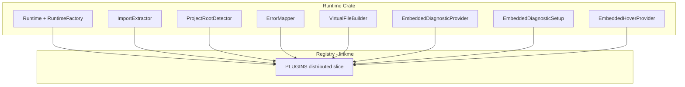

# Adding a New Runtime to Poly-bench

This checklist describes how to add support for a new language runtime (e.g. Python, C#, Zig) to poly-bench. The architecture is modular: implement a small set of traits and register them. Many components are now dynamic—they iterate over `supported_languages()` or use `Lang`-keyed maps—so you only touch a few files when adding a runtime.

> **Design Reference**: For a comprehensive description of the runtime plugin architecture, see [RUNTIME_PLUGIN_ARCHITECTURE.md](./RUNTIME_PLUGIN_ARCHITECTURE.md).

## What You Must Touch (4 required + 0–1 optional)

The runtime plugin registry is dynamic, but `Lang` enums are compile-time types and must be updated explicitly.

When adding a new runtime, you must modify these files:

| # | File | Change |
|---|------|--------|
| 1 | `poly-bench-dsl/src/ast.rs` | Add variant to `Lang` enum; update `from_str` and `as_str` |
| 2 | `poly-bench-syntax/src/partial_ast.rs` | Add same variant to `Lang`; update `from_str` and `as_str` |
| 3 | `poly-bench-runtime/Cargo.toml` | Add `runtimes-<lang> = { path = "../runtimes/runtimes-<lang>" }` |
| 4 | Root `Cargo.toml` | Add `"runtimes/runtimes-<lang>"` to workspace `members` |
| 5 | `poly-bench-grammar/bindings/rust/build.rs` | Add entry to `languages` array for tree-sitter injections |

Optional (backward compatibility only):

| # | File | Change |
|---|------|--------|
| 6 | `poly-bench-runtime/src/lib.rs` | Add `pub mod <lang> { ... }` re-export only if you keep per-language backward-compat re-exports |

**No longer required when adding a runtime:** `poly-bench-lsp-traits`, `poly-bench-runtime/registry.rs`, `poly-bench-runtime-traits/src/config.rs`, `poly-bench-executor` language wiring, `cli/main.rs` language switch wiring, `runtime_env_<lang>` helpers, `has_<lang>()` call-site plumbing, and manual edits to `poly-bench-grammar/queries/injections.scm`.

## Runtime Integration Interface

The following components form the end-to-end interface. Core orchestration uses abstractions that iterate over `supported_languages()` or use `Lang`-keyed maps.

| Component | Location | Purpose |
|-----------|----------|---------|
| `Lang` | poly-bench-dsl | Language enum; add variant when adding runtime |
| `RuntimeFactory` | runtimes/runtimes-*/ | Create runtime instances |
| `supported_languages()` | poly-bench-runtime/registry | Derived from linkme-registered plugins |
| `RuntimeConfig` | poly-bench-runtime-traits | `HashMap<Lang, Option<PathBuf>>`; no per-language fields |
| `ProjectRoots` | poly-bench-executor | `HashMap<Lang, Option<PathBuf>>`; no per-language fields |
| `RuntimePlugin` | runtimes/runtimes-*/ | Register via `#[distributed_slice(PLUGINS)]` |
| `LangDisplayInfo` | poly-bench-runtime-traits | Labels, colors; each runtime exports `*_lang_display()` |
| `Runtime` | poly-bench-runtime-traits | compile_check, run_benchmark; implemented in runtimes-* |
| `ImportExtractor` | poly-bench-ir | Parse setup imports; register via `RuntimePlugin` |
| `ProjectRootDetector` | poly-bench-runtime-traits | Find project root; register via `RuntimePlugin` |
| `runtime_env(project_root, lang)` | poly-bench-project | Single function; no per-language helpers |
| `--project-dir LANG:DIR` | CLI | Generic; no per-language flags |
| `has_runtime(lang)` | poly-bench-project/manifest | Single method; no per-language has_* |
| Grammar injections | poly-bench-grammar | Generated from `languages` array in build.rs |

## Overview



## Checklist

### 1. poly-bench-dsl: Add language variant

- `poly-bench-dsl/src/ast.rs`: Add variant (e.g. `Java`) to `Lang` enum
- Update `from_str` (e.g. `"java" | "jvm" => Some(Lang::Java)`)
- Update `as_str` (e.g. `Lang::Java => "java"`)

### 2. poly-bench-syntax: Add language variant

- `poly-bench-syntax/src/partial_ast.rs`: Add the same variant to `Lang`
- Update `from_str` and `as_str` to match poly-bench-dsl

### 3. poly-bench-grammar: Add to injections

- `poly-bench-grammar/bindings/rust/build.rs`: Add entry to the `languages` array:
  ```rust
  ("Java", &["java", "jvm"], "java", false),  // (display_name, tags, tree_sitter_name, use_paren_code_block)
  ```
- Use `true` for `use_paren_code_block` only if the language uses `(paren_code_block)` for import sections (Go does; others use `(code_block)`)

### 4. runtimes/: Create the runtime crate

- Create `runtimes/runtimes-<lang>/` (e.g. `runtimes/runtimes-java`)
- Add to root `Cargo.toml` workspace `members`
- Add `runtimes-<lang>` dependency to `poly-bench-runtime/Cargo.toml`
- **Quick start**: Copy `runtimes/runtimes-rust` as a template

#### 4a. Implement Runtime and RuntimeFactory

- Implement `Runtime` trait: `compile_check`, `run_benchmark`, `lang`, etc.
- Implement `RuntimeFactory`: `create(&self, config) -> Box<dyn Runtime>`
- Use `config.get_root(Lang::Java)` to get the project root (RuntimeConfig is `HashMap<Lang, Option<PathBuf>>`)

#### 4b. Implement RuntimePlugin and register via linkme

- Implement `RuntimePlugin` trait
- Add `#[distributed_slice(poly_bench_runtime_traits::PLUGINS)]` in your plugin module:
  ```rust
  #[distributed_slice(poly_bench_runtime_traits::PLUGINS)]
  static _JAVA: &dyn RuntimePlugin = &JAVA_PLUGIN;
  ```
- Add `linkme = "0.3"` to your runtime crate's `Cargo.toml`
- **No changes to poly-bench-runtime/registry.rs** — plugins self-register

#### 4c. Add display metadata

- Export `fn <lang>_lang_display() -> LangDisplayInfo`
- poly-bench-runtime dispatches via the registry

### 5. poly-bench-project: Manifest config (if using poly-bench projects)

If your runtime needs a `[project.<lang>]` section in `polybench.toml`:

- `poly-bench-project/src/manifest.rs`:
  - Add `JavaConfig` struct (or equivalent)
  - Add `java: Option<JavaConfig>` to `Manifest`
  - Add match arm in `has_runtime()`: `Lang::Java => self.java.is_some()`
  - Update `Manifest::new()` to handle the new language when creating from `languages` list

### 6. poly-bench-ir: Implement ImportExtractor

- In your runtime crate: Implement `ImportExtractor` trait
- Register via `RuntimePlugin::import_extractor()`

### 7. poly-bench-project: Implement ProjectRootDetector

- In your runtime crate: Add `src/project.rs`, implement `ProjectRootDetector`
- Define `marker_files()` (e.g. `["pom.xml", "build.gradle"]`)
- Register via `RuntimePlugin::project_root_detector()`
- **No `runtime_env_<lang>` needed** — use `runtime_env(project_root, lang)` which is already dynamic

### 8. runtimes/runtimes-<lang>: Implement ErrorMapper

- Implement `ErrorMapper` trait
- Register via `RuntimePlugin::error_mapper()`

### 9. runtimes/runtimes-<lang>: Implement VirtualFileBuilder

- Add `src/virtual_file.rs`, implement `VirtualFileBuilder`
- Use `VirtualFileBuilderCore` for shared logic
- Register via `RuntimePlugin::virtual_file_builder()`

### 10. runtimes/runtimes-<lang>: Implement EmbeddedDiagnosticProvider

- Add `src/embedded_diagnostics.rs`
- Implement `EmbeddedDiagnosticProvider`
- Register via `RuntimePlugin::embedded_diagnostic_provider()`

### 11. runtimes/runtimes-<lang>: Implement EmbeddedDiagnosticSetup (if needed)

- Implement `EmbeddedDiagnosticSetup`
- Register via `RuntimePlugin::embedded_diagnostic_setup()`

### 12. runtimes/runtimes-<lang>: Implement EmbeddedHoverProvider (required for LSP parity)

- Add `src/hover.rs`, implement `EmbeddedHoverProvider`
- Register via `RuntimePlugin::embedded_hover_provider()`

### 13. runtimes/runtimes-<lang>: Implement Embedded LSP client (if using LSP)

- Add `src/<server>_client.rs`
- Implement `LspConfig`, use `LspClient<YourConfig>`
- Implement `embedded_lsp_client_init` and `embedded_lsp_client_get` in `RuntimePlugin`

### 14. poly-bench-stdlib (if needed)

- Add language-specific constants if the language uses `use std::*`

## File Summary

| Component | Files to Create | Files to Modify |
|-----------|-----------------|-----------------|
| DSL | - | `poly-bench-dsl/src/ast.rs` |
| Syntax | - | `poly-bench-syntax/src/partial_ast.rs` |
| Grammar | - | `poly-bench-grammar/bindings/rust/build.rs` |
| Runtime | `runtimes/runtimes-<lang>/` | `poly-bench-runtime/Cargo.toml`, root `Cargo.toml` |
| Manifest (optional) | - | `poly-bench-project/src/manifest.rs` |
| IR | `runtimes-<lang>/import_extractor.rs` | `RuntimePlugin::import_extractor()` |
| Project | `runtimes-<lang>/project.rs` | `RuntimePlugin::project_root_detector()` |
| Error mapping | `runtimes-<lang>/error_mapping.rs` | `RuntimePlugin::error_mapper()` |
| LSP virtual files | `runtimes-<lang>/virtual_file.rs` | `RuntimePlugin::virtual_file_builder()` |
| LSP diagnostics | `runtimes-<lang>/embedded_diagnostics.rs` | `RuntimePlugin::embedded_diagnostic_provider()` |
| LSP setup | (same file) | `RuntimePlugin::embedded_diagnostic_setup()` |
| LSP hover | `runtimes-<lang>/hover.rs` | `RuntimePlugin::embedded_hover_provider()` |
| LSP client | `runtimes-<lang>/<server>_client.rs` | `RuntimePlugin::embedded_lsp_client_init/get()` |

**Not in the list:** `poly-bench-lsp-traits` (uses `Lang::from_str`), `poly-bench-runtime/registry.rs` (linkme), `poly-bench-runtime-traits/config.rs` (HashMap), `poly-bench-executor` (HashMap), `cli/main.rs` (generic `--project-dir`).

## LSP Support Requirements

For full LSP parity:

- **EmbeddedDiagnosticProvider** — lint/type-check for embedded code
- **EmbeddedHoverProvider** — hover and type info
- Both rely on **VirtualFileBuilder** for position mapping

Without EmbeddedHoverProvider, embedded code has diagnostics but no hover.

## Verification

After adding a runtime:

1. `cargo build` succeeds
2. `poly-bench run --lang <lang> <benchfile>` runs benchmarks
3. `poly-bench compile --lang <lang>` validates
4. `poly-bench run --project-dir <lang>:<path>` works for explicit roots
5. LSP diagnostics and hover work in embedded blocks (if implemented)
