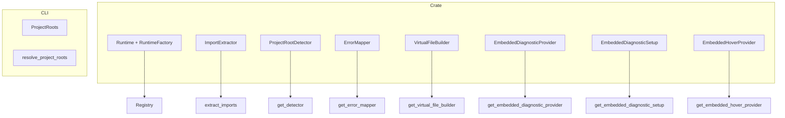

# Adding a New Runtime to Poly-bench

This checklist describes how to add support for a new language runtime (e.g. Python, C#, Zig) to poly-bench. The architecture is modular: implement a small set of traits and register them. No changes to core orchestration logic are required.

## Runtime Integration Interface

The following components form the end-to-end interface for a runtime. All orchestration (validation, scheduler, reporter, CLI) uses these abstractions—no per-language `match` branches in core logic.

| Component | Location | Purpose |
|-----------|----------|---------|
| `Lang` | poly-bench-dsl | Language enum variant |
| `RuntimeFactory` | poly-bench-runtime/registry | Create runtime instances |
| `supported_languages()` | poly-bench-runtime/registry | Source of truth for which langs exist |
| `LangDisplayInfo` | poly-bench-runtime/lang_display | Labels, colors, gradients for UI |
| `Runtime` | poly-bench-runtime/traits | compile_check, run_benchmark, precompile |
| `ImportExtractor` | poly-bench-ir | Parse setup imports |
| `ProjectRootDetector` | poly-bench-project | Find project root |
| `ErrorMapper` | poly-bench-runtime | Remap compiler errors to .bench lines |
| `VirtualFileBuilder` | poly-bench-lsp-v2 | Build virtual files for LSP |
| `EmbeddedDiagnosticProvider` | poly-bench-lsp-v2 | Lint/errors for embedded code |
| `EmbeddedHoverProvider` | poly-bench-lsp-v2 | Hover, type info (required for LSP parity) |

## Overview

## Checklist

### 1. poly-bench-dsl: Add language variant

Add the new language to `Lang` in `poly-bench-dsl`:

- `poly-bench-dsl/src/ast.rs`: Add variant (e.g. `Python`) to `Lang` enum
- Update `from_str` and `as_str` for the new variant

### 2. poly-bench-syntax: Add language variant

Add the new language to `Lang` in `poly-bench-syntax` (used by LSP):

- `poly-bench-syntax/src/partial_ast.rs`: Add variant to `Lang` enum
- Update `from_str` and `as_str`

### 3. poly-bench-runtime: Implement Runtime and RuntimeFactory

- Create `poly-bench-runtime/src/python/` (or your language folder)
- Implement `Runtime` trait: `compile_check`, `run_benchmark`, `lang`, etc.
- Implement `RuntimeFactory: create(&self, config) -> Box<dyn Runtime>`
- Add to `RuntimeConfig` and `ProjectRoots`: e.g. `python_root: Option<PathBuf>`
- Register in `poly-bench-runtime/src/registry.rs`: add to `FACTORIES` and `supported_languages()`
- Add display metadata in `poly-bench-runtime/src/lang_display.rs`: add a match arm in `lang_display()` for label, full_name, color, gradient_id, gradient_end, terminal_color (used by executor, reporter, CLI)

### 4. poly-bench-ir: Implement ImportExtractor

- In `poly-bench-ir/src/imports.rs`: Implement `ImportExtractor` trait
- Add `extract_<lang>_imports(setup: &str) -> ParsedSetup`
- Add to `extract_imports()` match

### 5. poly-bench-project: Implement ProjectRootDetector

- In `poly-bench-project/src/detectors.rs`: Implement `ProjectRootDetector`
- Define `marker_files()` (e.g. `["requirements.txt", "pyproject.toml"]`)
- Add to `get_detector()` match
- Add `runtime_env_<lang>` in `poly-bench-project` if using poly-bench layout

### 6. poly-bench-runtime: Implement ErrorMapper

- In `poly-bench-runtime/src/error_mapping.rs`: Implement `ErrorMapper`
- `build_mappings(suite, generated) -> LineMappings`
- `remap_error(error, mappings) -> String`
- Add to `get_error_mapper()` match

### 7. poly-bench-lsp-v2: Implement VirtualFileBuilder

- In `poly-bench-lsp-v2/src/virtual_files.rs`:
  - Add `Virtual<Lang>File` struct
  - Add `VirtualFileBuilderImpl::new_<lang>` and `build_<lang>`
  - Implement `VirtualFileBuilder` and add to `get_virtual_file_builder()`

### 8. poly-bench-lsp-v2: Implement EmbeddedDiagnosticProvider

- Create `poly-bench-lsp-v2/src/embedded_diagnostics/<lang>.rs`
- Implement `check_<lang>_blocks(virtual_file) -> Vec<EmbeddedDiagnostic>`
- Add to `get_embedded_diagnostic_provider()` match

### 9. poly-bench-lsp-v2: Implement EmbeddedDiagnosticSetup (if needed)

- In `poly-bench-lsp-v2/src/embedded_diagnostics/mod.rs`:
  - Implement `EmbeddedDiagnosticSetup` (e.g. init LSP client, ensure config)
  - Add to `get_embedded_diagnostic_setup()` match

### 10. poly-bench-lsp-v2: Implement EmbeddedHoverProvider (required for LSP parity)

- In `poly-bench-lsp-v2/src/hover_providers.rs`:
  - Implement `EmbeddedHoverProvider` (use LSP client for hover)
  - Add to `get_embedded_hover_provider()` match
  - Add `Virtual<Lang>FileManager` to `VirtualFileManagers` if using typed managers
- Required for full embedded-language support (hover, type info, completions). Without it, embedded code blocks will have diagnostics but no hover.

### 11. CLI: Add support

- In `cli/main.rs`:
  - Add `--lang <lang>` and `--<lang>-project` options
  - Update `ProjectRoots` and `resolve_project_roots` for the new language
  - Add to compile/run language filters

### 12. poly-bench-stdlib: Add constants (if needed)

- In `poly-bench-stdlib`: Add language-specific constants and stdlib code if the language uses `use std::*`

## File Summary

| Component | Files to Create | Files to Modify |
|-----------|-----------------|-----------------|
| DSL | - | `poly-bench-dsl/src/ast.rs` |
| Syntax | - | `poly-bench-syntax/src/partial_ast.rs` |
| Runtime | `poly-bench-runtime/src/<lang>/` | `registry.rs`, `config.rs`, `lang_display.rs` |
| IR | - | `poly-bench-ir/src/imports.rs` |
| Project | - | `poly-bench-project/src/detectors.rs` |
| Error mapping | - | `poly-bench-runtime/src/error_mapping.rs` |
| LSP virtual files | - | `poly-bench-lsp-v2/src/virtual_files.rs` |
| LSP diagnostics | `embedded_diagnostics/<lang>.rs` | `embedded_diagnostics/mod.rs` |
| LSP hover | - | `poly-bench-lsp-v2/src/hover_providers.rs` |
| CLI | - | `cli/main.rs` |

## LSP Support Requirements

For full LSP parity with other runtimes, a new language must implement:

- **EmbeddedDiagnosticProvider** — lint errors and type-check diagnostics for embedded code
- **EmbeddedHoverProvider** — hover information and type details
- Both rely on **VirtualFileBuilder** and **VirtualFileManager** for position mapping

Without EmbeddedHoverProvider, embedded code will show diagnostics but no hover or completion support.

## Verification

After adding a runtime:

1. `cargo build` succeeds
2. `poly-bench run --lang <lang> <benchfile>` runs benchmarks
3. `poly-bench compile --lang <lang>` validates
4. LSP diagnostics appear for embedded code
5. Hover works in embedded blocks (required for LSP parity)
