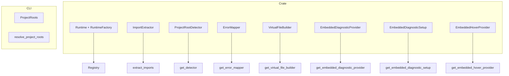

# Adding a New Runtime to Poly-bench

This checklist describes how to add support for a new language runtime (e.g. Python, C#, Zig) to poly-bench. The architecture is modular: implement a small set of traits and register them. No changes to core orchestration logic are required.

> **Design Reference**: For a comprehensive description of the runtime plugin architecture, the target `runtimes/` workspace structure, data flow, and migration path, see [RUNTIME_PLUGIN_ARCHITECTURE.md](./RUNTIME_PLUGIN_ARCHITECTURE.md).

## Runtime Integration Interface

The following components form the end-to-end interface for a runtime. All orchestration (validation, scheduler, reporter, CLI) uses these abstractions—no per-language `match` branches in core logic.

| Component | Location | Purpose |
|-----------|----------|---------|
| `Lang` | poly-bench-dsl | Language enum variant |
| `RuntimeFactory` | runtimes/runtimes-*/ | Create runtime instances; registered in poly-bench-runtime |
| `supported_languages()` | poly-bench-runtime/registry | Source of truth for which langs exist |
| `LangDisplayInfo` | poly-bench-runtime-traits | Labels, colors, gradients; each runtime exports `*_lang_display()` |
| `Runtime` | poly-bench-runtime-traits | compile_check, run_benchmark, precompile; implemented in runtimes-* |
| `ImportExtractor` | poly-bench-ir | Parse setup imports |
| `ProjectRootDetector` | poly-bench-project | Find project root |
| `ErrorMapper` | runtimes/runtimes-*/ | Remap compiler errors to .bench lines; dispatched via get_error_mapper |
| `VirtualFileBuilder` | runtimes/runtimes-*/ | Build virtual files for LSP; register via `RuntimePlugin::virtual_file_builder()` |
| `EmbeddedDiagnosticProvider` | runtimes/runtimes-*/ | Lint/errors for embedded code; register via `RuntimePlugin::embedded_diagnostic_provider()` |
| `EmbeddedDiagnosticSetup` | runtimes/runtimes-*/ | Init LSP clients, ensure config; register via `RuntimePlugin::embedded_diagnostic_setup()` |
| `EmbeddedHoverProvider` | runtimes/runtimes-*/ | Hover, type info; register via `RuntimePlugin::embedded_hover_provider()` |
| `EmbeddedLspClient` | runtimes/runtimes-*/ | LSP client for diagnostics/hover; register via `RuntimePlugin::embedded_lsp_client_init/get()` |
| `HelperFunctionExtractor` | runtimes/runtimes-*/ | Optional: for LSP undefined-function diagnostics |
| Fixture serialization | poly-bench-ir | `as_*_bytes()` for fixture data in generated code |
| Manifest config | poly-bench-project | `[lang]` section in polybench.toml |
| CompileWorkspace | poly-bench-executor | `init_*_workspace()`, `clean()` for .polybench/ |
| Grammar injections | poly-bench-grammar | Tree-sitter rules for embedded code highlighting |

## Overview

## Checklist

### 1. poly-bench-dsl: Add language variant

Add the new language to `Lang` in `poly-bench-dsl`:

- `poly-bench-dsl/src/ast.rs`: Add variant (e.g. `Python`) to `Lang` enum
- Update `from_str` and `as_str` for the new variant

### 2. poly-bench-syntax: Add language variant

Add the new language to `Lang` in `poly-bench-syntax` (used by LSP):

- `poly-bench-syntax/src/partial_ast.rs`: Add variant to `Lang` enum
- Update `from_str` and `as_str`

### 3. runtimes/: Create a new runtime crate

- Create `runtimes/runtimes-<lang>/` (e.g. `runtimes/runtimes-python` for Python)
- Add to root `Cargo.toml` workspace members
- Implement `Runtime` trait (from poly-bench-runtime-traits): `compile_check`, `run_benchmark`, `lang`, etc.
- Implement `RuntimeFactory`: `create(&self, config) -> Box<dyn Runtime>`
- Add to `RuntimeConfig` (in poly-bench-runtime-traits): e.g. `python_root: Option<PathBuf>`
- Register in `poly-bench-runtime/src/registry.rs`: add `runtimes_<lang>::<LANG>_PLUGIN` to the `PLUGINS` array (e.g. `&GO_PLUGIN, &TS_PLUGIN, ...`). `supported_languages()` is derived from PLUGINS automatically.
- Add `poly-bench-runtime` dependency on `runtimes-<lang>`
- Add display metadata: export `fn <lang>_lang_display() -> LangDisplayInfo` (poly-bench-runtime `lang_display()` dispatches to it)
- **Quick start**: Copy `runtimes/runtimes-rust` as a template—it has the full structure (codegen, executor, error_mapping, lang_display)

### 4. poly-bench-ir: Implement ImportExtractor

- In your runtime crate: Implement `ImportExtractor` trait (from poly-bench-ir-traits)
- Register via `RuntimePlugin::import_extractor()`. `init_import_extractors()` (called at startup) collects from all plugins.

### 5. poly-bench-project: Implement ProjectRootDetector

- In your runtime crate: Add `src/project.rs` and implement `ProjectRootDetector` (from poly-bench-runtime-traits)
- Define `marker_files()` (e.g. `["requirements.txt", "pyproject.toml"]`)
- Register via `RuntimePlugin::project_root_detector()`
- Add `runtime_env_<lang>` in `poly-bench-project` if using poly-bench layout

### 6. runtimes/runtimes-<lang>: Implement ErrorMapper

- In your runtime crate: Implement `ErrorMapper` (from poly-bench-runtime-traits)
- `build_mappings(suite, generated) -> LineMappings`
- `remap_error(error, mappings) -> String`
- Implement `error_mapper()` in your `RuntimePlugin` to return the builder. No separate match in poly-bench-runtime.

### 7. runtimes/runtimes-<lang>: Implement VirtualFileBuilder

- In your runtime crate: Add `src/virtual_file.rs`
- Implement `VirtualFileBuilder` trait (from poly-bench-lsp-traits)
- Use `VirtualFileBuilderCore` for shared build logic
- Implement `virtual_file_builder()` in your `RuntimePlugin` to return the builder

### 8. runtimes/runtimes-<lang>: Implement EmbeddedDiagnosticProvider

- In your runtime crate: Add `src/embedded_diagnostics.rs`
- Implement `EmbeddedDiagnosticProvider` trait (use `EmbeddedDiagnosticContext` for LSP clients)
- Implement `embedded_diagnostic_provider()` in your `RuntimePlugin`

### 9. runtimes/runtimes-<lang>: Implement EmbeddedDiagnosticSetup (if needed)

- In your runtime crate: Implement `EmbeddedDiagnosticSetup` trait
- `prepare(module_root, ctx)` typically calls `ctx.ensure_ready(self.lang(), module_root)`
- Implement `embedded_diagnostic_setup()` in your `RuntimePlugin`

### 10. runtimes/runtimes-<lang>: Implement EmbeddedHoverProvider (required for LSP parity)

- In your runtime crate: Add `src/hover.rs`
- Implement `EmbeddedHoverProvider` trait (use `EmbeddedHoverContext` for virtual file and LSP client via `ctx.get_lsp_client(lang, module_root)`)
- Implement `embedded_hover_provider()` in your `RuntimePlugin`
- Required for full embedded-language support (hover, type info). Without it, embedded code blocks will have diagnostics but no hover.

### 10b. runtimes/runtimes-<lang>: Implement Embedded LSP client (if using LSP for diagnostics/hover)

- In your runtime crate: Add `src/<server>_client.rs` (e.g. `gopls_client.rs`, `pyright_client.rs`)
- Implement `LspConfig` trait (from poly-bench-lsp-traits) for your language server
- Use `LspClient<YourConfig>` type alias
- Implement `embedded_lsp_client_init(workspace_root)` and `embedded_lsp_client_get()` in your `RuntimePlugin`
- Required for full LSP parity when diagnostics/hover use an LSP server (Go, TypeScript, Rust, Python)
- Optional: Add `HelperFunctionExtractor` for undefined-function diagnostics

### 11. CLI: Add support

- In `cli/main.rs`:
  - Add `--lang <lang>` and `--<lang>-project` options
  - Update `ProjectRoots` and `resolve_project_roots` for the new language
  - Add to compile/run language filters

### 12. poly-bench-stdlib: Add constants (if needed)

- In `poly-bench-stdlib`: Add language-specific constants and stdlib code if the language uses `use std::*`

## File Summary

| Component | Files to Create | Files to Modify |
|-----------|-----------------|-----------------|
| DSL | - | `poly-bench-dsl/src/ast.rs` |
| Syntax | - | `poly-bench-syntax/src/partial_ast.rs` |
| Runtime | `runtimes/runtimes-<lang>/` | `poly-bench-runtime/registry.rs`, root `Cargo.toml` |
| IR | `runtimes-<lang>/import_extractor.rs` | `RuntimePlugin::import_extractor()` |
| Project | `runtimes-<lang>/project.rs` | `RuntimePlugin::project_root_detector()` |
| Error mapping | `runtimes-<lang>/error_mapping.rs` | `RuntimePlugin::error_mapper()` |
| LSP virtual files | `runtimes-<lang>/virtual_file.rs` | `RuntimePlugin::virtual_file_builder()` |
| LSP diagnostics | `runtimes-<lang>/embedded_diagnostics.rs` | `RuntimePlugin::embedded_diagnostic_provider()` |
| LSP setup | `runtimes-<lang>/embedded_diagnostics.rs` | `RuntimePlugin::embedded_diagnostic_setup()` |
| LSP hover | `runtimes-<lang>/hover.rs` | `RuntimePlugin::embedded_hover_provider()` |
| LSP client | `runtimes-<lang>/<server>_client.rs` | `RuntimePlugin::embedded_lsp_client_init/get()` |
| CLI | - | `cli/main.rs` |

## LSP Support Requirements

For full LSP parity with other runtimes, a new language must implement:

- **EmbeddedDiagnosticProvider** — lint errors and type-check diagnostics for embedded code
- **EmbeddedHoverProvider** — hover information and type details
- Both rely on **VirtualFileBuilder** and **VirtualFileManager** for position mapping

Without EmbeddedHoverProvider, embedded code will show diagnostics but no hover or completion support.

## Verification

After adding a runtime:

1. `cargo build` succeeds
2. `poly-bench run --lang <lang> <benchfile>` runs benchmarks
3. `poly-bench compile --lang <lang>` validates
4. LSP diagnostics appear for embedded code
5. Hover works in embedded blocks (required for LSP parity)
