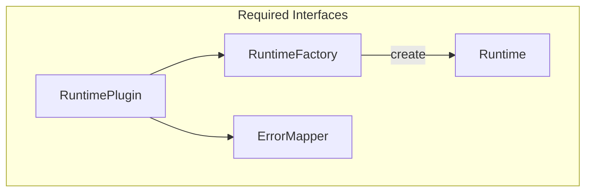

This page provides an exhaustive guide for adding a new runtime to poly-bench. Follow the checklists and touchpoints to ensure full integration. Each section lists the interfaces, files, and steps you need.

<Aside type="tip">
<span>For a step-by-step walkthrough with minified code, see the [Case Study: Python](/docs/developers/case-study-python). It shows how each section was implemented for the Python runtime.</span>
</Aside>

---

## Spec Overview

The runtime must implement the interfaces in poly-bench-traits. The core flow looks like this:



---

## Required Implementations (Checklist)

You must implement the following interfaces. The table below summarizes each one:

| Interface | Crate | Purpose |
|-----------|-------|---------|
| `Runtime` | runtimes-* | `initialize`, `generate_check_source`, `compile_check`, `run_benchmark`, `shutdown` |
| `RuntimeFactory` | runtimes-* | `lang`, `name`, `create(config)` |
| `ErrorMapper` | runtimes-* | `build_mappings`, `remap_error` — map compiler errors to .bench lines |
| `RuntimePlugin` | runtimes-* | Bundle all; register via `#[distributed_slice(PLUGINS)]` |

### Runtime Trait Methods

From `poly-bench-traits/src/traits.rs`:

| Method | Required | Purpose |
|--------|----------|---------|
| `name()` | Yes | Display name of the runtime |
| `lang()` | Yes | Language enum variant |
| `set_anvil_rpc_url()` | No | For std::anvil; default no-op |
| `precompile()` | No | Build before timed runs; default no-op |
| `last_precompile_nanos()` | No | For accurate precompile timing; default None |
| `initialize(suite)` | Yes | Suite-level setup (e.g. set project root) |
| `generate_check_source(spec, suite)` | Yes | Source for caching and compile-check |
| `compile_check(spec, suite)` | Yes | Validate syntax/types without running |
| `run_benchmark(spec, suite)` | Yes | Return `Measurement` |
| `shutdown()` | Yes | Cleanup |

<Aside type="caution">
<span>All five required methods — <code>initialize</code>, <code>generate_check_source</code>, <code>compile_check</code>, <code>run_benchmark</code>, <code>shutdown</code> — must be implemented. Missing any will cause a compile error.</span>
</Aside>

---

## Optional LSP Implementations (Checklist)

LSP support is optional but recommended for editor diagnostics and hover. The following interfaces enable it:

| Interface | Purpose |
|-----------|---------|
| `VirtualFileBuilder` | Build virtual source from embedded blocks for diagnostics/hover |
| `EmbeddedLspClient` | `init`, `get` — LSP client for the language |
| `EmbeddedDiagnosticProvider` | Run diagnostics on virtual files |
| `EmbeddedDiagnosticSetup` | Prepare env before diagnostics (e.g. ensure tsconfig) |
| `EmbeddedHoverProvider` | Hover for embedded code |
| `HelperFunctionExtractor` | Undefined-function diagnostics |
| `ProjectRootDetector` | Detect module root when `.polybench/runtime-env` missing |
| `ImportExtractor` | Extract imports from setup blocks (poly-bench-ir) |

<Aside type="note">
<span>LSP is optional. The runtime will work for <code>poly-bench run</code> without it. Add LSP later for editor hover, diagnostics, and completion in embedded blocks.</span>
</Aside>

### LspConfig

From `poly-bench-traits/src/lsp_client.rs`. Implement for your language server:

| Member | Purpose |
|--------|---------|
| `SERVER_NAME` | Name for logging |
| `LANGUAGE_ID` | Document language ID for LSP |
| `find_executable()` | Find server in PATH |
| `find_executable_in_workspace(workspace_root)` | Check `.polybench/runtime-env/\{lang}/` first |
| `server_args()` | Args to pass to server |
| `server_args_for_path(path)` | Override args by path (e.g. pyright vs pyright-langserver) |
| `current_dir(workspace_root)` | Working directory for subprocess |
| `request_timeout_ms()` | Timeout for slow servers |
| `additional_capabilities()` | LSP init capabilities |

---

## Codebase Touchpoints (Checklist)

When adding a new runtime, you will need to modify the following locations. The table below lists each file and what to change:

| Location | Change |
|----------|--------|
| `poly-bench-dsl/src/ast.rs` | Add `Lang::NewLang`, update `ALL`, `from_str`, `as_str`, `aliases`, `grammar_display_name`, `tree_sitter_injection_name`, `uses_paren_import_block` |
| `poly-bench-project/src/manifest.rs` | Add `NewLangConfig`, `Manifest::new_lang`, `has_runtime`, `Manifest::new` defaults |
| `poly-bench-project/src/init.rs` | Add `Lang::NewLang` branch in `init_runtime_env_for_lang` |
| `poly-bench-project/src/build.rs` | Add `build_newlang_env`, call from `build_runtime_env_for_lang` |
| `poly-bench-project/src/templates.rs` | Add `newlang_*` template functions |
| `poly-bench-project/src/deps.rs` | Add `add_newlang_dep` if deps supported |
| `poly-bench-runtime/Cargo.toml` | Add `runtimes-newlang = { path = "runtimes/runtimes-newlang" }` |
| `poly-bench-runtime/src/registry.rs` | No change — plugin auto-discovered via `PLUGINS` |
| `poly-bench-runtime/runtimes/runtimes-newlang/` | New crate: `plugin.rs`, `executor.rs`, `codegen.rs`, `error_mapping.rs`, etc. |

---

## Execution Flow

When poly-bench runs a benchmark, it follows this flow:

1. Precompile — precompile(spec, suite) builds or compiles before timed runs (optional).
2. Initialize — initialize(suite) sets the project root and prepares the environment.
3. Compile check — compile_check(spec, suite) validates syntax and types.
4. Run — run_benchmark(spec, suite) spawns a subprocess or invokes the runtime and parses stdout for Measurement.

### Measurement Format

The benchmark binary or script must print JSON to stdout. poly-bench parses the last non-empty line. The minimum required fields are:

```json
{
  "iterations": 1000,
  "total_nanos": 12345678,
  "nanos_per_op": 12345.678,
  "ops_per_sec": 81000.5
}
```

Optional: `warmup_nanos`, `samples` (array of per-iteration nanos for outlier detection), `bytes_per_op`, `allocs_per_op` (memory benchmarks), `raw_result`, `successful_results`, etc.

Use `Measurement::from_aggregate(iterations, total_nanos)` or `Measurement::from_aggregate_with_sample_stats(...)` to construct from parsed data.

<Aside type="caution">
<span>The benchmark binary/script must print JSON on the <strong>last non-empty line</strong> of stdout. poly-bench parses that line; other output (logs, progress) can appear above it.</span>
</Aside>

---

## LSP Integration Flow

The LSP integration works as follows:

1. Virtual file — VirtualFileBuilder::build(params) produces a VirtualFile with content and section_mappings (bench span to virtual line).
2. Write to disk — The LSP layer writes to .lsp_virtual/virtual_*.\{ext} so the language server can see the file.
3. Diagnostics — EmbeddedDiagnosticProvider::check_blocks() triggers did_change and request_diagnostics, then maps diagnostics back via virtual_to_bench.
4. LSP client — embedded_lsp_client_init(workspace_root) starts the language server; find_executable_in_workspace checks .polybench/runtime-env/\{lang}/ first.

---

## Integration Tests (Checklist)

You should add integration tests for the new runtime. The table below lists the recommended tests:

| Test | Location | Purpose |
|------|----------|---------|
| Execution snapshot | `runtimes-newlang/tests/execution_snapshot.rs` | `initialize` + `run_benchmark`, assert `Measurement` sanity |
| LSP integration | `integration-tests/tests/lsp_newlang.rs` | Temp project, init, build, LSP client, hover |
| Init runtime dirs | `integration-tests/tests/init_runtime_dirs.rs` | Add new lang to `languages`; assert files created |
| External deps | `integration-tests/tests/external_deps.rs` | If applicable (e.g. C, C#, Zig) |

Tests use `#[ignore = "requires X toolchain"]`; run with:

```bash
cargo test -p runtimes-newlang execution_snapshot -- --ignored
cargo test -p integration-tests lsp_newlang -- --ignored --nocapture
```

---

## Plugin Registration

```rust
#[distributed_slice(poly_bench_traits::PLUGINS)]
static _NEWLANG: &dyn RuntimePlugin = &NEWLANG_PLUGIN;
```

Ensure the runtime crate is a dependency of `poly-bench-runtime` so the plugin is linked.

---

## LangDisplayInfo

`RuntimePlugin::lang_display()` returns `LangDisplayInfo` (labels, colors, gradients) for UI and charts.

---

## ErrorMapper

`ErrorMapper::build_mappings(suite, generated_code)` produces `LineMappings` — mappings from generated code line ranges to .bench file lines. `remap_error(error, mappings)` rewrites compiler output to reference .bench locations.

---

## Reference Implementations

Study existing runtimes for patterns. Each has different characteristics:

- **Go:** [runtimes-go](https://github.com/evm-tooling/poly-bench/tree/main/poly-bench-runtime/runtimes/runtimes-go) — full LSP (gopls), VirtualFileBuilder, EmbeddedDiagnosticProvider
- **Rust:** [runtimes-rust](https://github.com/evm-tooling/poly-bench/tree/main/poly-bench-runtime/runtimes/runtimes-rust) — cargo check JSON parsing for diagnostics
- **TypeScript:** [runtimes-ts](https://github.com/evm-tooling/poly-bench/tree/main/poly-bench-runtime/runtimes/runtimes-ts) — V8 in-process execution, no subprocess
